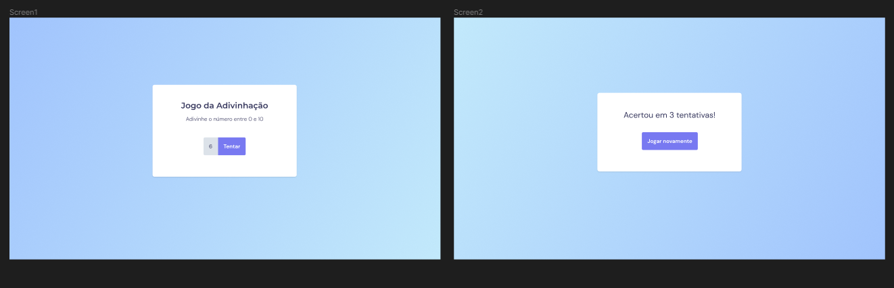

<h1 align="center"> Jogo da Adivinhação </h1>

  <a href="#-tecnologias">Tecnologias</a>&nbsp;&nbsp;&nbsp;|&nbsp;&nbsp;&nbsp;
  <a href="#-projeto">Projeto</a>&nbsp;&nbsp;&nbsp;|&nbsp;&nbsp;&nbsp;
  <a href="#-layout">Layout</a>&nbsp;&nbsp;&nbsp;|&nbsp;&nbsp;&nbsp;
  <a href="#-layout">Documentação Lógica</a>&nbsp;&nbsp;&nbsp;

 

## 🚀 Tecnologias

Esse projeto foi desenvolvido com as seguintes tecnologias:

- HTML
- CSS
- JavaScript
- Figma

## 💻 Projeto

O intuito desse desafio era replicar um Jogo da Adivinhação proposto pela RocketSeat.

Proposta:

  

## ✅ Resultado
- [Acesse o resultado finalizado do Jogo da Adivinhação, online](https://devbonatto.github.io/JogoDaAdivinhacao/)

## 🔖 Layout

Você pode visualizar o layout do projeto através [DESSE LINK](https://www.figma.com/file/yzL7gxARFsTrcTsAzfaQyf/Jogo-Adivinha%C3%A7%C3%A3o-Copy?fuid=1369823793362288511)

## 📄 Documentação Lógica
[CLIQUE AQUI](https://smallpdf.com/pt/file#s=b84d3063-273f-4396-9dc3-c52514f57a0f) para ver a documentação lógica do projeto.
